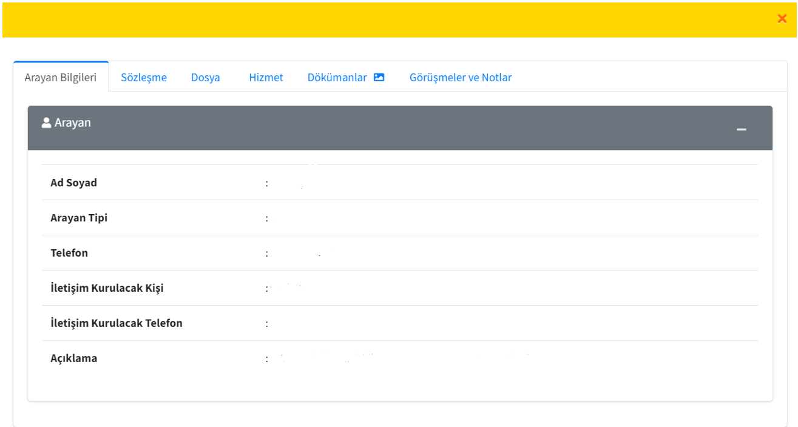
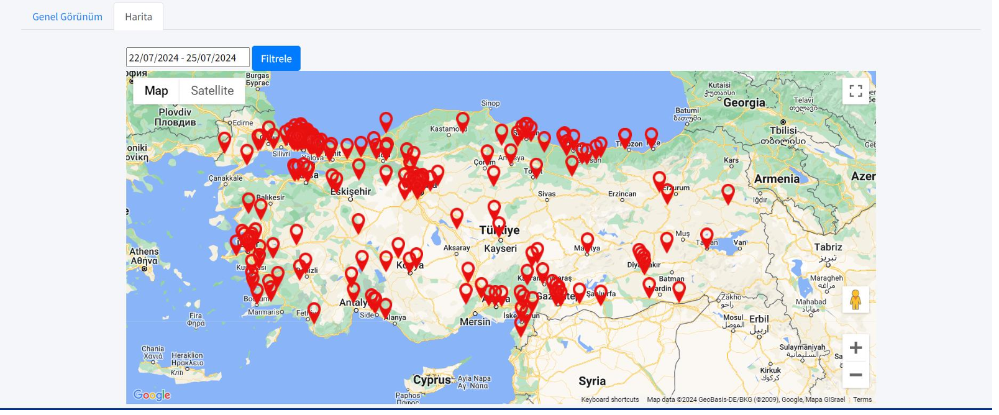
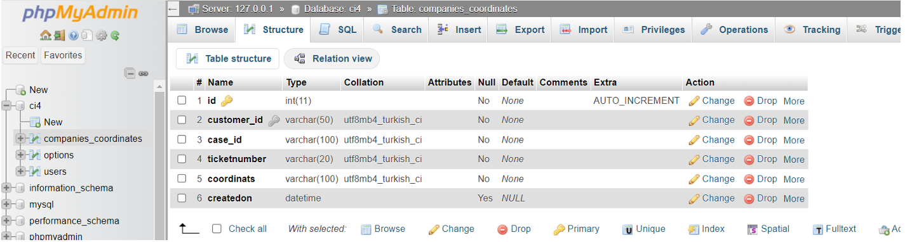

#  CRM Map Visualization  Internship Project

This project was developed during my software internship at **Remed Assistance**.

It visualizes customer service cases on a Google Map using coordinates stored in a MySQL database.  
The system was built using **PHP (CodeIgniter)**, **AJAX**, and **MySQL**.

---

##  Features

- Visualizes customer service requests on an interactive map
- Data is fetched from a CRM system and plotted as location markers
- Backend powered by CodeIgniter framework
- Filtering by date range
- Secure access to anonymized data only (demo version)

---

##  Screenshots

| Modal View | Map View | Database Structure |
|------------|----------|---------------------|
|  |  |  |

---

##  Technologies Used

- **PHP** (CodeIgniter)
- **AJAX** for dynamic frontend updates
- **MySQL** for storing coordinates and customer cases
- **Google Maps API** for geospatial visualization

---

##  Folder Structure

```
crm-map-visualization/
├── map-demo.php
├── README.md
└── screenshots/
    ├── page.png
    ├── map.png
    └── Database.png
```

---

##  Notes

> This version contains mocke or anonymized data for demonstration purposes.  
> Original code was part of a real-world project during my internship and cannot include sensitive client data.

---

##  Developer

**İrem Kabaoğlu**  
Junior Web Developer – ASP.NET Core | React | AI Projects  
